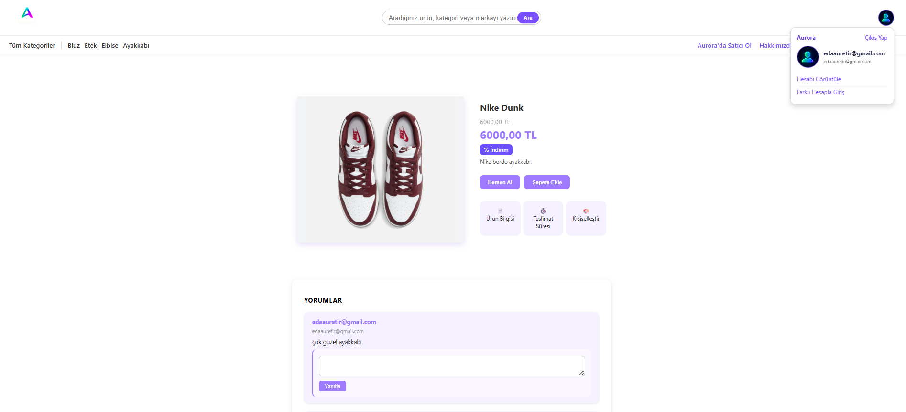

# Aurora E-Commerce - E-Ticaret
 
**Bu proje, 1 ay sürede geliştirilmiş kurumsal e-ticaret web uygulamasıdır.
Ürün, kategori ve sipariş yönetimi süreçlerini kapsar.**
 
---
 
## Rolüm  
- **Developer** olarak backend ve frontend geliştirmeleri yaptım.  
- **Scrum Master** rolüyle sprint planlama ve ekip koordinasyonuna destek sağladım.  
 
---
 
## Teknolojiler & Özellikler  
- **Backend:** .NET, C#, ASP.NET MVC, EF Core, SQL Server  
- **Frontend:** HTML, CSS, JavaScript
- **Diğer:** Azure, Design Manager, Identity, EF Core Migration, Asenkron Programlama  
 
---
 
## Mimari ve Prensipler  
- Onion Architecture  
- SOLID  
- IoC & Dependency Injection  
- Unit of Work  
- AutoMapper  
- Clean Code  
 
---
 
## Katkılarım  
- Takım koordinasyonu  
- Clean Code uygulamaları  
- UI/UX tasarım yönetimi  
- Bulut ortamında kurumsal geliştirme deneyimi
---
 
### Kullanıcı Giriş & Kayıt
  
 
---
 
### Satıcı Başvurusu

 
---
 
### Admin Paneli

 
---
 
### Satıcı Paneli
  
 
---
 
### Ürün Sayfası
  

  
> Daha fazla ekran görüntüsü için [ReadMe_Images klasörüne](readme_images/) bakabilirsiniz.
